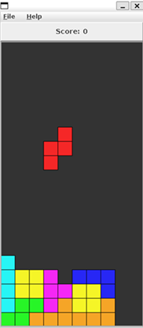

# Tetris


## Description
Simple Tetris game implemented in Java using Java Swing for the graphical user interface. The game features standard Tetris mechanics, including piece rotation and line clearing.

## Requirements

- Java 17 or higher
- Maven 3.8.4 or higher

## Installation

1. Clone the repository:
   ```bash
   git clone https://github.com/cksaldanha/tetris.git
    ```
2. Navigate to the project directory:
   ```bash
   cd tetris 
   ```
3. Build the project using Maven:
   ```bash
   mvn clean package
   ```
4. Run the application:
   ```bash
   mvn spring-boot:run -Dlogging.level=INFO
   ```

